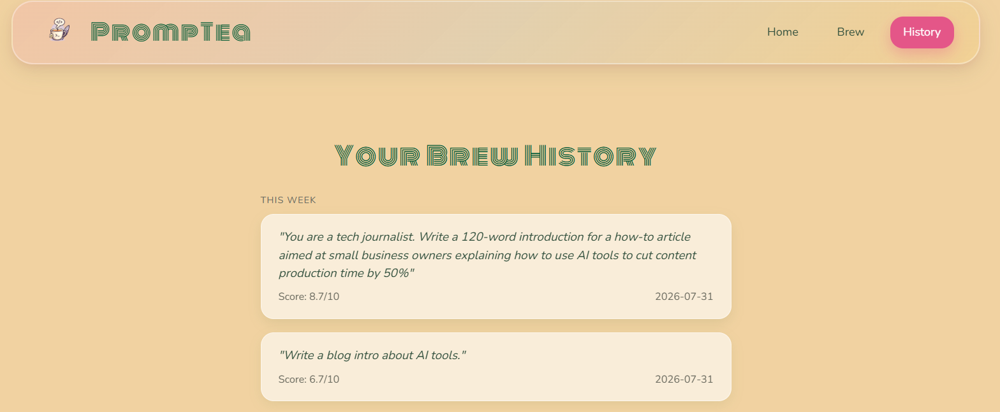

# 🍵 PrompTea

**PrompTea** is an AI-powered **Prompt Engineering Copilot** that transforms rough user ideas into structured, high-quality, production-ready prompts.

Built with **React, Flask, LangGraph, LangChain, and Groq**, PrompTea uses a multi-agent workflow to understand a user's intent, identify missing information, select suitable prompt engineering techniques, refine the prompt, critique the result, optimize it, simulate its expected output, score its quality, and explain the improvements.

> **Rough idea → Clarification → Analysis → Engineering → Refinement → Evaluation → Final Brew ☕**

---

## ✨ Features

* 🤖 **Agentic Prompt Engineering Workflow**
* 🔍 **Prompt Validation** to detect invalid, vague, casual, or unsafe inputs
* 🧠 **Complexity Analysis** to determine task difficulty
* ❓ **Information Gap Detection** to identify missing details
* 💬 **Interactive Clarification** when important information is missing
* 📝 **Context Extraction** using both the original prompt and user-provided answers
* 🎯 **Prompt Engineering Technique Selection**
* 🧠 **Strategy Generation** for the refinement process
* ✨ **Automatic Prompt Refinement**
* 🔍 **Critic Agent** with iterative refinement
* 💰 **Cost Optimization** for token efficiency
* 🧪 **Prompt Simulation** to predict output quality
* 📊 **Prompt Quality Scorecard**
* 💡 **Explainability** for every major refinement
* 🗂️ **Local Prompt History**
* 🌱 **Novice, Beginner, Intermediate, and Advanced Brewing Levels**
* ⚡ **React + Flask architecture**

---

## 🏗️ Architecture

PrompTea follows a staged agentic workflow.

```text
                         USER
                          │
                          ▼
                  ┌───────────────┐
                  │   Validation  │
                  └───────┬───────┘
                          │
                          ▼
                  ┌───────────────┐
                  │   Complexity  │
                  └───────┬───────┘
                          │
                          ▼
                  ┌───────────────┐
                  │ Gap Analysis  │
                  └───────┬───────┘
                          │
                  Missing information?
                    ┌─────┴─────┐
                    │           │
                   YES          NO
                    │           │
                    ▼           │
             User Clarification │
                    │           │
                    └─────┬─────┘
                          ▼
                  ┌───────────────┐
                  │    Context    │
                  └───────┬───────┘
                          │
                          ▼
                  ┌───────────────┐
                  │   Technique   │
                  └───────┬───────┘
                          │
                          ▼
                  ┌───────────────┐
                  │    Strategy   │
                  └───────┬───────┘
                          │
                          ▼
                  ┌───────────────┐
                  │    Refiner    │
                  └───────┬───────┘
                          │
                          ▼
                  ┌───────────────┐
                  │     Critic    │◄──────┐
                  └───────┬───────┘       │
                          │                │
                    Needs refinement?     │
                       YES ────────────────┘
                          │
                         NO
                          │
                          ▼
                  ┌───────────────┐
                  │ Cost Optimizer│
                  └───────┬───────┘
                          │
                          ▼
                  ┌───────────────┐
                  │   Simulator   │
                  └───────┬───────┘
                          │
                          ▼
                  ┌───────────────┐
                  │   Scorecard   │
                  └───────┬───────┘
                          │
                          ▼
                  ┌───────────────┐
                  │ Explainability│
                  └───────┬───────┘
                          │
                          ▼
                    ☕ FINAL BREW
```

---

## 🧩 Agent Workflow

### 1. Validation Agent

Checks whether the submitted input is suitable for PrompTea.

It can identify:

* Empty input
* Casual conversation
* Gibberish
* Direct queries
* Very vague prompts
* Prompt injection attempts
* Valid prompts

Only valid prompts continue through the main pipeline.

---

### 2. Complexity Agent

Analyses the task and determines:

* Task type
* Complexity level
* Complexity score
* Reasoning requirements
* Whether additional clarification may be necessary

---

### 3. Gap Analysis Agent

Identifies information that is **materially important** but missing from the prompt.

For example:

```text
User:
"Write an email to Flipkart requesting a return."

Gap Analysis:
- What product is being returned?
- What is the reason for the return?
- What tone should the email use?
```

PrompTea can pause the workflow and ask the user for the missing information instead of blindly making assumptions.

---

### 4. Interactive Clarification

When clarification is required:

```text
Backend
   ↓
Gap Questions
   ↓
Frontend Clarification Modal
   ↓
User Answers
   ↓
/continue
   ↓
Post-Gap Workflow
```

The answers are then passed into the Context Agent and used throughout the remaining workflow.

---

### 5. Context Agent

Combines:

* Original prompt
* Complexity analysis
* Gap analysis
* User-provided clarification

to construct a reliable understanding of the task.

---

### 6. Technique Selector

Selects appropriate prompt engineering techniques based on the task.

Examples include:

* Context Expansion
* Audience Specification
* Output Formatting
* Role Specification
* Constraint Definition

The agent also explains why each technique was selected.

---

### 7. Strategy Agent

Creates a refinement strategy describing how the prompt should be improved while preserving the user's original intent.

---

### 8. Refiner Agent

Generates the improved prompt using:

* Original intent
* Extracted context
* Selected techniques
* Refinement strategy
* User clarification

---

### 9. Critic Agent

Reviews the refined prompt for quality.

The critic evaluates whether the prompt is ready or requires another refinement cycle.

PrompTea supports iterative refinement:

```text
Refiner
   ↓
Critic
   │
   ├── Accept → Continue
   │
   └── Refine → Refiner → Critic
```

The retry loop is limited to prevent unnecessary iterations.

---

### 10. Cost Optimizer

Optimizes the final prompt for token efficiency while attempting to preserve its quality.

Depending on task complexity, PrompTea can use:

* Token Efficient
* Balanced
* Maximum Quality

optimization strategies.

---

### 11. Simulator

Provides a test prediction of what an AI system might produce from the optimized prompt.

It reports:

* Predicted quality
* Confidence
* Output preview
* Strengths
* Potential issues
* Estimated output tokens
* Recommendations

---

### 12. Scorecard

Evaluates the refined prompt across multiple dimensions:

* Clarity
* Specificity
* Structure
* Intent Preservation
* Hallucination Safety
* Strategy Adherence
* Readiness

An overall prompt quality score is also generated.

---

### 13. Explainability Agent

Produces human-readable "Tea Notes" explaining:

* What changed
* Why it changed
* What worked
* What could be improved

This makes PrompTea more than a prompt generator—it helps users understand **prompt engineering itself**.

---

## 🌱 Brewing Levels

PrompTea supports four explanation levels:

| Level           | Intended User                |
| --------------- | ---------------------------- |
| 🌱 Novice       | New to prompt engineering    |
| 🌿 Beginner     | Basic understanding          |
| 🌳 Intermediate | Comfortable with prompting   |
| 🍵 Advanced     | Experienced prompt engineers |

The selected level influences how PrompTea explains its decisions and refinements.

---

## 🛠️ Tech Stack

### Frontend

* React
* Vite
* JavaScript
* CSS
* React Markdown

### Backend

* Python
* Flask
* LangGraph
* LangChain
* LangChain-Groq
* Groq API

### Storage

* Browser `localStorage` for prompt history

---

## 📂 Project Structure

```text
PROMPTEA
│
├── backend
│   ├── agents
│   │   ├── validator.py
│   │   ├── complex.py
│   │   ├── gap.py
│   │   ├── context.py
│   │   ├── technique.py
│   │   ├── strategy.py
│   │   ├── refiner.py
│   │   ├── critic.py
│   │   ├── cost.py
│   │   ├── simulator.py
│   │   ├── scorecard.py
│   │   └── explainability.py
│   │
│   ├── graph
│   │   ├── state.py
│   │   └── workflow.py
│   │
│   ├── prompts
│   │   ├── validator_prompt.py
│   │   ├── gap_prompt.py
│   │   └── ...
│   │
│   ├── app.py
│   ├── config.py
│   ├── helpers.py
│   ├── requirements.txt
│   └── .env
│
├── frontend
│   ├── src
│   │   ├── assets
│   │   ├── components
│   │   └── pages
│   │
│   ├── package.json
│   └── vite.config.js
│
├── README.md
└── .gitignore
```

> **Note:** `venv/` should not be committed to Git. Create it locally during setup.

---

## 🚀 Installation

### 1. Clone the repository

```bash
git clone <repository-url>
cd PROMPTEA
```

---

### 2. Backend Setup

Create a virtual environment:

```bash
python -m venv venv
```

Activate it on Windows:

```powershell
venv\Scripts\activate
```

Install dependencies:

```bash
cd backend
pip install -r requirements.txt
```

Create a `.env` file inside `backend/`:

```env
GROQ_API_KEY=your_groq_api_key
```

Start the Flask backend:

```bash
python app.py
```

Backend:

```text
http://127.0.0.1:5000
```

---

### 3. Frontend Setup

Open another terminal:

```bash
cd frontend
npm install
npm run dev
```

The Vite development server will provide the frontend URL in the terminal.

---

## 🔐 Environment Variables

PrompTea requires a Groq API key.

**Never commit your real API key to GitHub.**

Example:

```env
GROQ_API_KEY=your_groq_api_key
```

The `.env` file should be included in `.gitignore`.

---

## 🔄 End-to-End Workflow

A typical PrompTea session looks like:

```text
1. User enters rough prompt
              ↓
2. Validation
              ↓
3. Complexity analysis
              ↓
4. Gap analysis
              ↓
5. Clarification, if required
              ↓
6. User provides missing information
              ↓
7. Context construction
              ↓
8. Technique selection
              ↓
9. Strategy generation
              ↓
10. Prompt refinement
              ↓
11. Critic evaluation
              ↓
12. Refinement retry, if necessary
              ↓
13. Cost optimization
              ↓
14. Output simulation
              ↓
15. Quality scorecard
              ↓
16. Explainability
              ↓
17. Final refined prompt
```

---

## 🌐 Live Project

### Live Demo

https://prompteagit.netlify.app/

### Backend API

https://promptea.onrender.com

### GitHub Repository

https://github.com/tpundir007-art/promptea

---

## 📸 Screenshots

### Home Page


### Brew Page


### History



---

## 👥 Team
git push n pull.
Built with love <3

---

## 📄 License

This project was developed for academic purposes.
