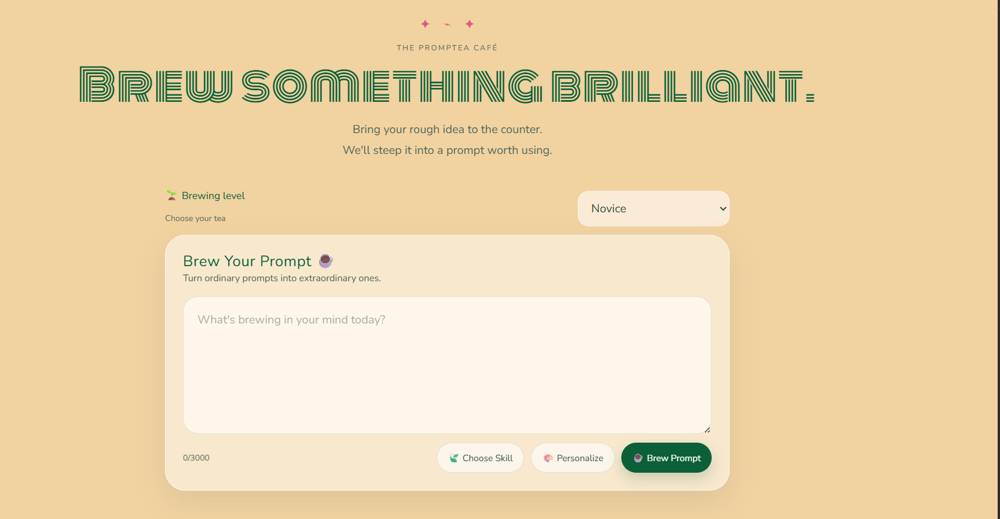
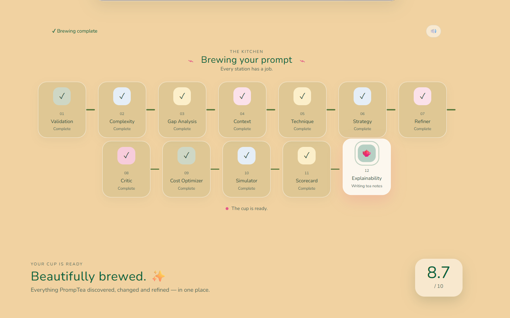
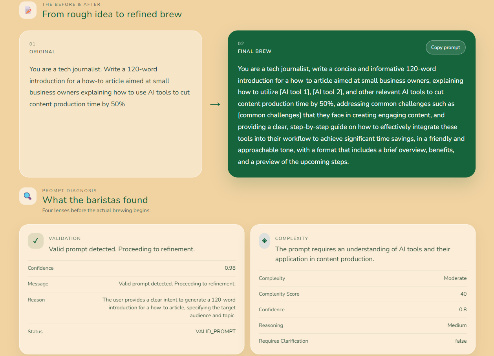
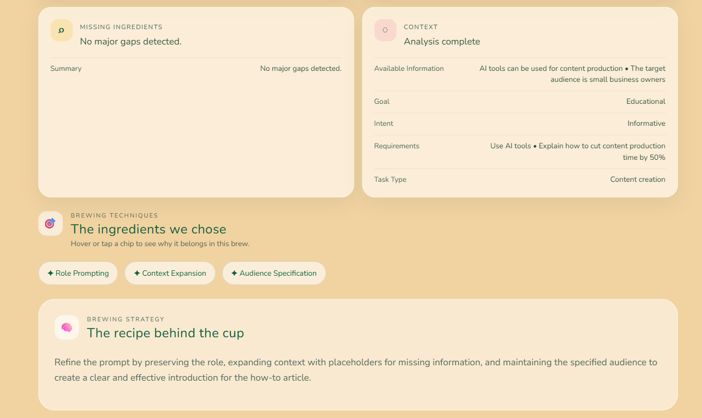
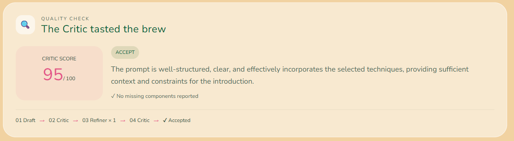
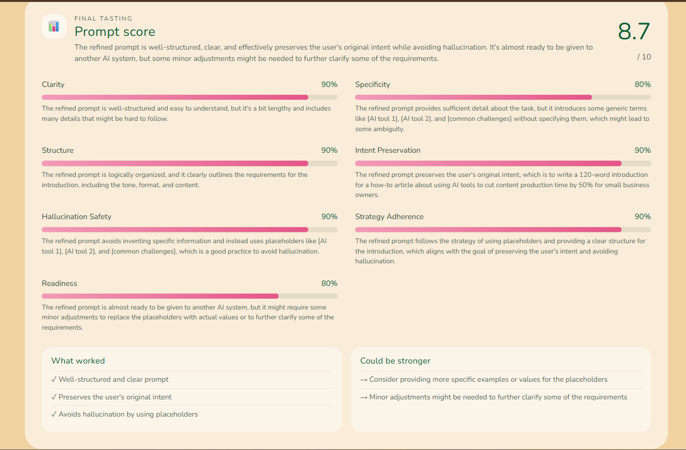
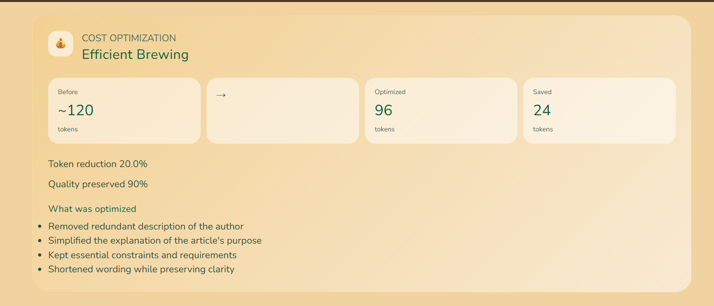
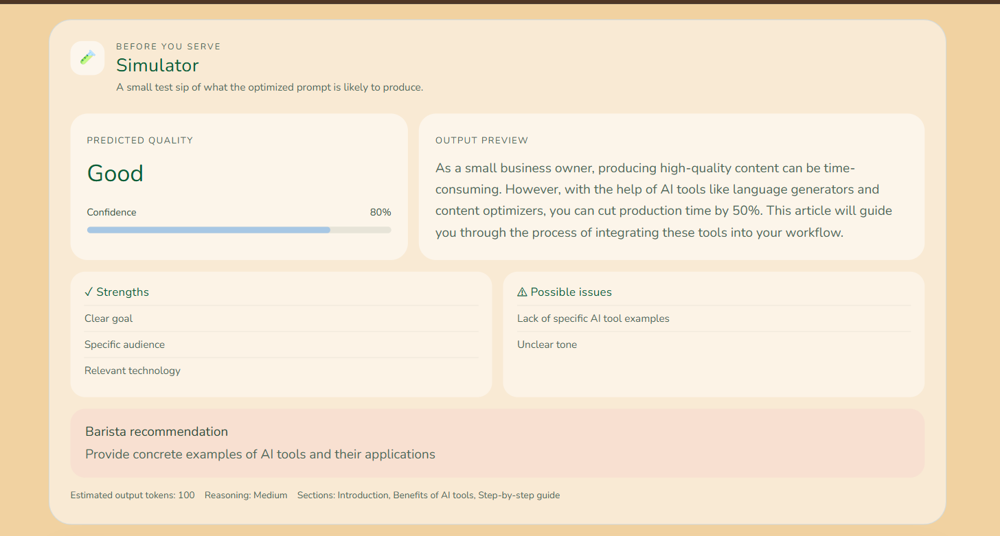
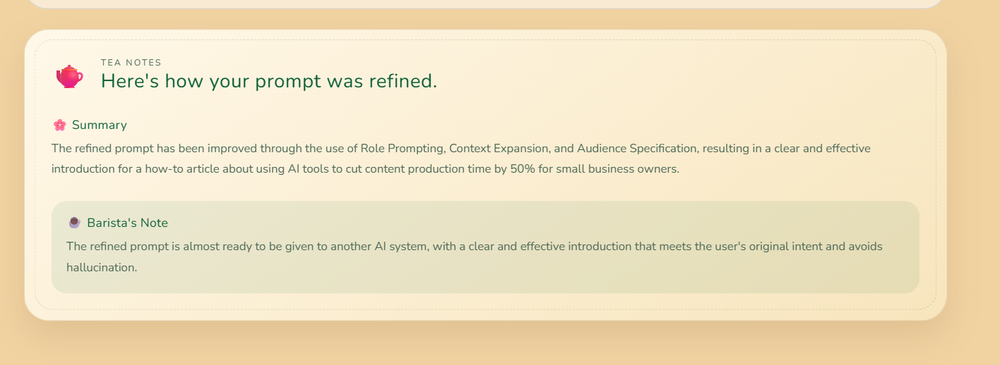

# 🍵 PrompTea

> **Brew something brilliant.**  
> Transform rough ideas into production-ready prompts using an intelligent multi-agent AI workflow.

PrompTea is an **AI-powered Prompt Engineering Copilot** that refines rough user ideas into structured, high-quality prompts suitable for modern Large Language Models.

Unlike traditional prompt enhancers, PrompTea follows an **agentic workflow** where multiple specialized AI agents collaborate to analyze, clarify, engineer, evaluate, optimize, and explain every prompt before producing the final result.

From the user's perspective, PrompTea behaves like an intelligent barista—

> **Bring your rough idea to the counter, and we'll steep it into a prompt worth using. ☕**

---

# ✨ Features

### 🤖 Agentic Prompt Engineering

A complete multi-agent pipeline instead of a single LLM call.

- Prompt Validation
- Complexity Analysis
- Gap Detection
- Interactive Clarification
- Context Building
- Prompt Engineering Technique Selection
- Strategy Generation
- Prompt Refinement
- Critic Loop
- Cost Optimization
- Prompt Simulation
- Prompt Scorecard
- Explainability

---

### 🔍 Smart Prompt Validation

PrompTea intelligently classifies incoming prompts before refinement.

It detects:

- ✅ Valid prompts
- 💬 Casual conversation
- ❓ Vague prompts
- ⚠️ Prompt injection attempts
- 🧩 Gibberish
- ➗ Simple mathematical expressions

Educational prompts such as

```
What is Machine Learning?
Explain DBMS.
Teach me Graphs.
```

are correctly recognised as **valid prompts** and continue through the refinement pipeline.

---

### 🧠 Complexity Analysis

The Complexity Agent evaluates:

- Task type
- Complexity level
- Complexity score
- Required reasoning depth
- Whether clarification may be needed

This helps later agents choose suitable prompt engineering strategies.

---

### ❓ Intelligent Gap Analysis

Instead of guessing missing information, PrompTea identifies details that are important for producing a better prompt.

Example:

**User**

```
Write an email requesting a refund.
```

Gap Analysis detects questions such as:

- What product?
- Refund reason?
- Desired tone?

Rather than hallucinating answers, PrompTea pauses and asks the user.

---

### 💬 Interactive Clarification

When important information is missing, PrompTea switches into an interactive clarification mode.

Workflow:

```
User Prompt
      ↓
Gap Analysis
      ↓
Questions Generated
      ↓
Frontend Modal
      ↓
User Answers
      ↓
/continue API
      ↓
Remaining AI Agents
```

The user's responses are preserved and injected back into the workflow, ensuring prompts are refined using **real user input instead of assumptions**.

---

### 🎨 Personalization

PrompTea allows users to customize the final prompt through reusable personalization presets.

Available options include:

- 📌 Include real-world examples
- 📋 Bullet point formatting
- 🪜 Step-by-step explanations
- ✂️ Concise responses

Users can also add their own custom personalization instructions.

Example:

```
Use analogies wherever possible.
```

These personalization preferences are preserved throughout the entire refinement pipeline.

---

# ☕ Brewing Levels

PrompTea supports multiple explanation levels.

| Level | Intended User |
|--------|---------------|
| 🌱 Novice | Completely new to prompting |
| 🌿 Beginner | Basic understanding |
| 🌳 Intermediate | Comfortable using AI prompts |
| 🍵 Advanced | Experienced prompt engineers |

The selected level changes how later agents explain their decisions.

---

# 🏗️ Architecture

PrompTea follows a staged agentic workflow.

```
                    USER
                      │
                      ▼
              ┌───────────────┐
              │ Validation    │
              └───────┬───────┘
                      │
                      ▼
              ┌───────────────┐
              │ Complexity    │
              └───────┬───────┘
                      │
                      ▼
              ┌───────────────┐
              │ Gap Analysis  │
              └───────┬───────┘
                      │
          Missing information?
              ┌───────┴────────┐
             YES              NO
              │                │
              ▼                │
      Interactive Clarification│
              │                │
              └───────┬────────┘
                      ▼
              ┌───────────────┐
              │ Context       │
              └───────┬───────┘
                      │
                      ▼
              ┌───────────────┐
              │ Technique     │
              └───────┬───────┘
                      │
                      ▼
              ┌───────────────┐
              │ Strategy      │
              └───────┬───────┘
                      │
                      ▼
              ┌───────────────┐
              │ Refiner       │
              └───────┬───────┘
                      │
                      ▼
              ┌───────────────┐
              │ Critic        │◄────────┐
              └───────┬───────┘         │
                      │                 │
                Needs refinement?       │
                 YES ───────────────────┘
                      │
                     NO
                      │
                      ▼
              ┌───────────────┐
              │ Cost Optimizer│
              └───────┬───────┘
                      │
                      ▼
              ┌───────────────┐
              │ Simulator     │
              └───────┬───────┘
                      │
                      ▼
              ┌───────────────┐
              │ Scorecard     │
              └───────┬───────┘
                      │
                      ▼
              ┌───────────────┐
              │ Explainability│
              └───────┬───────┘
                      │
                      ▼
                 ☕ FINAL BREW
```

---

# 🧩 Agent Workflow

## 1️⃣ Validation Agent

Determines whether the user's input should enter the pipeline.

Detects:

- Empty input
- Casual chat
- Gibberish
- Prompt injection
- Vague requests
- Direct mathematical queries
- Valid prompts

Only valid prompts proceed.

---

## 2️⃣ Complexity Agent

Measures task complexity and reasoning requirements.

Outputs:

- Complexity score
- Complexity level
- Reasoning depth
- Task type

---

## 3️⃣ Gap Analysis Agent

Identifies information that is materially missing.

Instead of hallucinating:

```
Write an email.
```

PrompTea asks questions first.

---

## 4️⃣ Context Agent

Combines:

- Original prompt
- Complexity analysis
- Gap analysis
- User clarification
- Personalization settings
- Brewing level

into a structured context package.

---

## 5️⃣ Technique Selection Agent

Chooses prompt engineering techniques such as:

- Context Expansion
- Constraints
- Output Formatting
- Role Specification
- Audience Specification
- Few-shot prompting
- Step-by-step reasoning

Each selected technique includes an explanation.

---

## 6️⃣ Strategy Agent

Produces a refinement strategy describing:

- how the prompt should change
- what should remain unchanged
- how assumptions should be avoided

---

## 7️⃣ Refiner Agent

Uses:

- Context
- Strategy
- Techniques
- User clarification
- Personalization

to generate the refined prompt.

---

## 8️⃣ Critic Agent

Reviews the refined prompt.

Possible outcomes:

```
Accept
```

or

```
Refine Again
```

PrompTea automatically retries refinement (up to three iterations) before continuing.

---

## 9️⃣ Cost Optimizer

After the prompt has been fully refined, PrompTea performs a final optimization pass to reduce unnecessary tokens while preserving quality.

Depending on the task complexity, one of three optimization modes is selected automatically:

| Mode | Purpose |
|------|---------|
| ⚡ Token Efficient | Prioritizes fewer tokens while preserving intent |
| ⚖️ Balanced | Maintains quality with moderate optimization |
| 🌟 Maximum Quality | Preserves every useful instruction regardless of length |

The Cost Optimizer:

- Removes redundant wording
- Merges repetitive instructions
- Simplifies phrasing
- Preserves user intent
- Never invents new requirements
- Never removes important constraints

It also reports:

- Estimated prompt tokens
- Token reduction percentage
- Quality preservation score
- Summary of optimization changes

---

## 🔟 Simulator Agent

Before presenting the final prompt, PrompTea performs a simulated execution.

Rather than actually solving the user's task, the Simulator predicts how another AI model is likely to respond.

It estimates:

- Predicted output quality
- Confidence score
- Expected output length
- Output preview
- Potential weaknesses
- Recommendations

This gives users an idea of how effective their refined prompt is before using it elsewhere.

---

## 1️⃣1️⃣ Scorecard Agent

The Scorecard Agent objectively evaluates the quality of the refined prompt.

Evaluation categories include:

- Clarity
- Specificity
- Structure
- Intent Preservation
- Hallucination Safety
- Strategy Adherence
- Readiness

An overall prompt quality score is generated along with:

### ✅ What Worked

Highlights the strongest aspects of the prompt.

### 🔧 Could Be Stronger

Suggests improvements without rewriting the prompt.

This helps users understand **why** a prompt is considered high quality.

---

## 1️⃣2️⃣ Explainability Agent

PrompTea doesn't just improve prompts—it teaches prompt engineering.

The Explainability Agent generates "Tea Notes" that explain:

- What changed
- Why those changes were made
- Which techniques were applied
- How the refinement improved the prompt
- Additional suggestions for future prompts

This educational layer makes PrompTea valuable for both beginners and experienced users.

---

# 🛠️ Tech Stack

### Frontend

- React
- Vite
- JavaScript
- CSS
- React Markdown

### Backend

- Python
- Flask
- LangGraph
- LangChain
- LangChain-Groq
- Groq API

### AI Model

- Llama 3.3 70B Versatile (Groq)

### Storage

- Browser Local Storage (Prompt History)

---

# 📂 Project Structure

```text
PROMPTEA
│
├── backend
│   ├── agents
│   │   ├── validator.py
│   │   ├── complex.py
│   │   ├── gap.py
│   │   ├── context.py
│   │   ├── technique.py
│   │   ├── strategy.py
│   │   ├── refiner.py
│   │   ├── critic.py
│   │   ├── cost.py
│   │   ├── simulator.py
│   │   ├── scorecard.py
│   │   └── explainability.py
│   │
│   ├── graph
│   │   ├── workflow.py
│   │   └── state.py
│   │
│   ├── prompts
│   │   ├── validator_prompt.py
│   │   ├── gap_prompt.py
│   │   ├── context_prompt.py
│   │   ├── strategy_prompt.py
│   │   ├── refiner_prompt.py
│   │   ├── critic_prompt.py
│   │   ├── cost_prompt.py
│   │   ├── simulator_prompt.py
│   │   ├── scorecard_prompt.py
│   │   └── explainability_prompt.py
│   │
│   ├── app.py
│   ├── helpers.py
│   ├── config.py
│   ├── requirements.txt
│   └── .env
│
├── frontend
│   ├── src
│   │   ├── components
│   │   ├── pages
│   │   ├── assets
│   │   └── styles
│   │
│   ├── package.json
│   └── vite.config.js
│
├── README.md
└── .gitignore
```

> **Note:** `venv/` should never be committed. Create it locally during setup.

---

# 🚀 Installation

## 1. Clone the Repository

```bash
git clone <repository-url>
cd PROMPTEA
```

---

## 2. Backend Setup

Create a virtual environment:

```bash
python -m venv venv
```

Activate it (Windows):

```bash
venv\Scripts\activate
```

Install dependencies:

```bash
cd backend
pip install -r requirements.txt
```

Create a `.env` file inside `backend/`:

```env
GROQ_API_KEY=your_groq_api_key
```

Start the backend:

```bash
python app.py
```

Backend:

```
http://127.0.0.1:5000
```

---

## 3. Frontend Setup

Open another terminal:

```bash
cd frontend
npm install
npm run dev
```

The Vite development server will provide the frontend URL.

---

# 🔐 Environment Variables

```env
GROQ_API_KEY=your_groq_api_key
```

Never commit your API key.

---

# 🌐 Backend API

## POST `/generate`

Starts a new prompt refinement session.

Example Request

```json
{
  "prompt": "Explain Machine Learning",
  "level": "Beginner",
  "personalization_presets": [
    "examples",
    "bullet_points"
  ],
  "personalization_custom": "Use simple analogies."
}
```

Possible Responses

- Complete refinement
- Clarification required
- Validation stopped

---

## POST `/continue`

Continues the workflow after Gap Analysis.

Example

```json
{
  "state": {...},
  "answers": {
    "Audience": "College students",
    "Tone": "Friendly"
  }
}
```

---

# 🔄 End-to-End Workflow

```text
User Prompt
      ↓
Validation
      ↓
Complexity Analysis
      ↓
Gap Analysis
      ↓
Clarification (if needed)
      ↓
User Answers
      ↓
Context Building
      ↓
Technique Selection
      ↓
Strategy Generation
      ↓
Prompt Refinement
      ↓
Critic Evaluation
      ↓
Retry (if required)
      ↓
Cost Optimization
      ↓
Prompt Simulation
      ↓
Quality Scorecard
      ↓
Explainability
      ↓
☕ FINAL BREW
```

---

## 📸 Screenshots

### 🏠 Home


### ✍️ Prompt Input


### 🫖 Kitchen — Agentic Workflow


### ✨ Refined Prompt


### 🎯 Technique Selection


### 🔍 Critic


### 📊 Scorecard


### 💰 Cost Optimization


### 🧪 Simulator


### 🫖 Tea Notes


### History


---

# 🌐 Live Demo

### 🚀 Frontend

https://prompteafinal.netlify.app/

### ⚙️ Backend API

https://promptea-final.onrender.com/

---

# 🚀 Future Improvements

Potential enhancements include:

- 🌍 Multi-language prompt engineering
- 📄 PDF and document prompt extraction
- 🧠 Prompt templates
- 🔄 Version comparison
- 📤 Export refined prompts
- 📊 Prompt analytics dashboard
- 🔑 User authentication
- ☁️ Cloud prompt history
- 🤝 Team collaboration
- 🧩 Additional prompt engineering techniques

---

# 👥 Team

Built with ❤️ by git push n pull.

---

# 📄 License

This project was developed for academic purposes.

Feel free to fork, learn from, and build upon it with proper attribution.